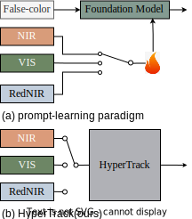
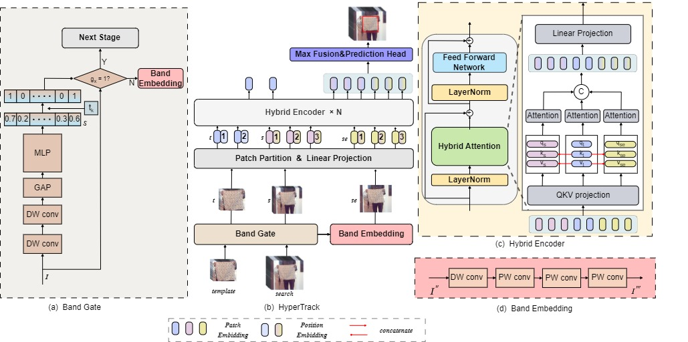
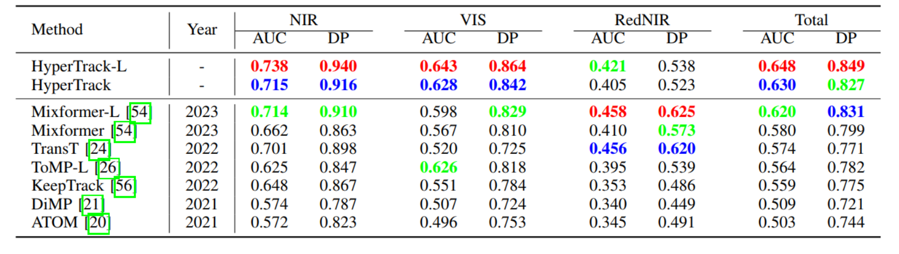
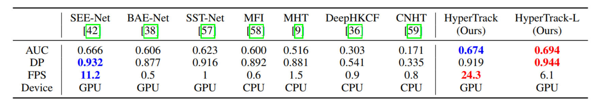

# HyperTrack： a unified framework for hyperspectral object tracking
Official implementation of HyperTrack, including models and training&testing codes.


<center></center>


## Introduction
A new unified hyperspectral tracking framework (e.g. VIS, NIR, and RedNIR Tracking).

- HyperTrack has high performance on hyperspectal tracking tasks.

- A single model cross three kinds of hyperspectral images.
<center></center>


## Results
### On HOT2023 tracking benchmarks
<center></center>


### On HOT2022 tracking benchmark
<center></center>

## Usage
### Installation
Create and activate a conda environment:
```
conda create -n hypertrack python=3.7
conda activate hypertrack
```
Install the required packages:
```
bash install_hypertrack.sh
```

### Data Preparation
Put the training datasets in ./data/. It should look like:
```
$<PATH_of_HyperTrack>
-- data
    -- Test
        |-- VIS
        |-- NIR
        |-- RedNIR
        ...
    -- Train
        |-- VIS
        |-- NIR
        |-- RedNIR
        ...

```

### Path Setting
Run the following command to set paths:
```
cd <PATH_of_HyperTrack>
python tracking/create_default_local_file.py --workspace_dir . --data_dir ./data --save_dir ./output
```
You can also modify paths by these two files:
```
./lib/train/admin/local.py  # paths for training
./lib/test/evaluation/local.py  # paths for testing
```

### Training
Dowmload the pretrained [foundation model](https://drive.google.com/drive/folders/1wyeIs3ytYkmAtTXoVlLMkJ4aSTq5CBHq) (Mixformer) 
and put it under ./pretrained_networks/.
```
python run_training.py
```
You can train models with various modalities and variants by modifying ```run_train.py```.

### Testing
HOT2022/HOT2023\
```
python test.py
```
You can test models with various modalities and variants by modifying ```test.py```.

## Acknowledgment
- This repo is based on [Mixformer](https://github.com/MCG-NJU/MixFormer) which is an excellent work.
- We thank for the [PyTracking](https://github.com/visionml/pytracking) library, which helps us to quickly implement our ideas.


